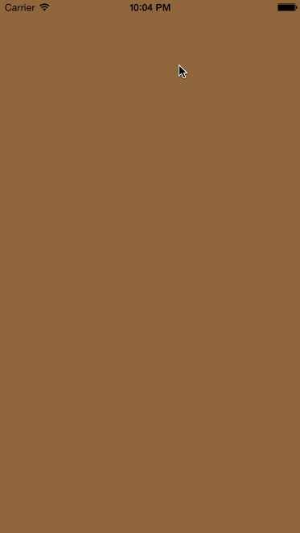

# Pull To Switch component #
---



A simple component that allows you to switch between two views, animated using the power and the simplicity of UIKit Dynamics and inspired by the well-known gesture "Pull to refresh".

This component was imagined by my UI/UX designer friend [Julien Martin](https://twitter.com/julienmartin_) for a simple application with two main views that the user can easily switch between.

You will find a full Xcode project with the component source code and a quick example to integrate it in your own project.

## How to use it ##
---

Drag and drop the `WAPullToSwitchComponent` folder in your project.

The component inherits from the UIViewController class, thus you can instantiate it just as you will do with a standard UIViewController (with or without a nib).


Don't forget the import:

```
#import "WAPullToSwitchViewController.h"
```

Then you provide a data source.

```
WAPullToSwitchViewController *pullToSwitchViewController = [[WAPullToSwitchViewController alloc] init];
pullToSwitchViewController.dataSource = self;
```

You can then directly use the view of the component:

```
UIView *componentView = pullToSwitchViewController.view;
[self.view addSubview:componentView];
```

Let's just setup the component view size to fit the superview:

```


NSArray *fitSuperviewConstraintsHorizontal = [NSLayoutConstraint constraintsWithVisualFormat:@"H:|[componentView]|" options:0 metrics:nil views:NSDictionaryOfVariableBindings(componentView)];
NSArray *fitSuperviewConstraintsVertical = [NSLayoutConstraint constraintsWithVisualFormat:@"V:|[componentView]|" options:0 metrics:nil views:NSDictionaryOfVariableBindings(componentView)];


[self.view addConstraints:fitSuperviewConstraintsHorizontal];
[self.view addConstraints:fitSuperviewConstraintsVertical];
```


You must implement the data source protocol needed to build and customize the component. There is only one required method that will ask the data source (*see below for the protocol definition*) object for: the two views between you want to switch to. Those views can be as tall as you want because the component use scroll views to embed the requested views. Optional methods can be implemented to customize the animation behavior.

Below, you will find the full protocol description:

***WAPullToSwitchProtocol.h***

```

@protocol WAPullToSwitchDataSource <NSObject>

@required
// Ask the DataSource object for the view at the specified index.
- (UIView *)viewForIndex:(int)index;

@optional
// Default : WAPullToSwitchConstants.h:WAPULLTOSWITCH_DEFAULT_BOUNCE_GRAVITY.
- (float)gravityVectorYComponentForBounce;
// Default : WAPullToSwitchConstants.h:WAPULLTOSWITCH_DEFAULT_BOUNCE_ELASTICITY.
- (float)elasticityCoefficientForBounce;
// Default : WAPullToSwitchConstants.h:WAPULLTOSWITCH_DEFAULT_HIDE_GRAVITY
- (float)gravityVectorYComponentForHide;

@end

```

The last step is to implement the data source to provide two views for the component. You can also customize the behavior of the hide and bounce animations by providing values for the gravity and the elasticity component:


```

#pragma mark - WAScrollGravitySwitchDataSource

- (UIScrollView *)viewForIndex:(int)index
{
NSString *stringNibName = nil;

if (index == 0) {
stringNibName = @"ViewOne";
} else {
stringNibName = @"ViewTwo";
}

return [[[NSBundle mainBundle] loadNibNamed:stringNibName owner:nil options:nil] objectAtIndex:0];
}

// Optional methods implementation.
//	
//- (float)gravityVectorYComponentForHide {
//    return 4.0f;
//}
//
//- (float)gravityVectorYComponentForBounce {
//    return -3.0f;
//}
//
//- (float)elasticityCoefficientForBounce {
//    return 0.1f;
//}

```

**Note:** the views you provide to the component using the data source can be instances of any kind of view, from a UIScrollView to a full custom UIView, and can be as tall as you want (the height of the frame isn't important).


## License ##
---


```
    This is free and unencumbered software released into the public domain.

    Anyone is free to copy, modify, publish, use, compile, sell, or
    distribute this software, either in source code form or as a compiled
    binary, for any purpose, commercial or non-commercial, and by any
    means.

    In jurisdictions that recognize copyright laws, the author or authors
    of this software dedicate any and all copyright interest in the
    software to the public domain. We make this dedication for the benefit
    of the public at large and to the detriment of our heirs and
    successors. We intend this dedication to be an overt act of
    relinquishment in perpetuity of all present and future rights to this
    software under copyright law.

    THE SOFTWARE IS PROVIDED "AS IS", WITHOUT WARRANTY OF ANY KIND,
    EXPRESS OR IMPLIED, INCLUDING BUT NOT LIMITED TO THE WARRANTIES OF
    MERCHANTABILITY, FITNESS FOR A PARTICULAR PURPOSE AND NONINFRINGEMENT.
    IN NO EVENT SHALL THE AUTHORS BE LIABLE FOR ANY CLAIM, DAMAGES OR
    OTHER LIABILITY, WHETHER IN AN ACTION OF CONTRACT, TORT OR OTHERWISE,
    ARISING FROM, OUT OF OR IN CONNECTION WITH THE SOFTWARE OR THE USE OR
    OTHER DEALINGS IN THE SOFTWARE.

    For more information, please refer to <http://unlicense.org/>
```


